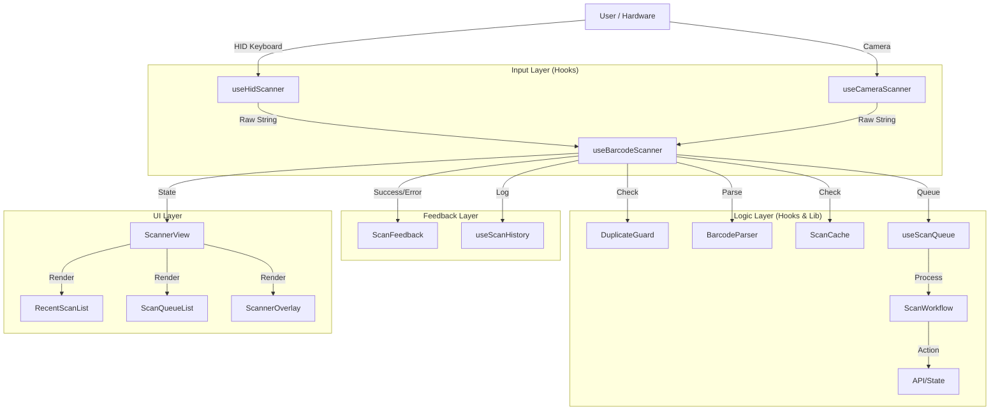

# WMS Scanner V2 Architecture

## 🏗️ Architecture Overview

The new scanner implementation follows a modular architecture designed for reliability, extensibility, and performance in a warehouse environment.



## 📂 File Structure

- **`components/scanner/`**: UI components
  - `ScannerView.tsx`: Main container and logic binder
  - `ScannerOverlay.tsx`: Camera viewfinder overlay
  - `RecentScanList.tsx`: History display
  - `ScanQueueList.tsx`: Processing queue visualization

- **`hooks/`**: React Hooks for logic
  - `useBarcodeScanner.ts`: Main orchestration hook
  - `useHidScanner.ts`: HID (USB/Bluetooth) scanner input handler
  - `useCameraScanner.ts`: Camera (Mobile/Webcam) handler
  - `useScanQueue.ts`: Async queue management
  - `useScanHistory.ts`: Local history state

- **`lib/scanner/`**: Core utilities
  - `barcodeParser.ts`: Identifies barcode types (Product vs Location)
  - `duplicateGuard.ts`: Prevents accidental double-scans
  - `scanCache.ts`: Client-side caching for instant lookup
  - `scanFeedback.ts`: Audio and haptic feedback

- **`lib/workflows/`**: Business logic
  - `scanWorkflow.ts`: Handles mode-specific logic (Inbound, Outbound, Count, etc.)

- **`types/`**: TypeScript definitions
  - `scanner.ts`: Shared types

## 🚀 Key Features

1. **Unified Input Handling**: Seamlessly switches between USB scanner (HID) and Camera.
2. **Robust Queue System**: Handles rapid scanning without data loss.
3. **Duplicate Guard**: Intelligent debouncing based on scan mode.
4. **Mode-Specific Workflows**:
   - `Lookup`: Quick info retrieval
   - `Count`: Inventory counting with aggregation
   - `Inbound/Outbound/Relocation`: Context-aware processing
5. **Feedback System**: Visual, Audio, and Haptic feedback for clear user confirmation.
6. **Caching**: Instant results for repeated scans.

## 🛠️ Usage

### Basic Implementation

```tsx
import ScannerView from '@/components/scanner/ScannerView';

export default function Page() {
  return <ScannerView />;
}
```

### Custom Implementation (using hook)

```tsx
import { useBarcodeScanner } from '@/hooks/useBarcodeScanner';

export function MyCustomScanner() {
  const { manualScan, history } = useBarcodeScanner({
    mode: 'inbound',
    processScan: async (code, mode) => {
      // Custom logic here
      return await myApiCall(code);
    }
  });

  return (
    <div>
      <button onClick={() => manualScan('12345')}>Simulate Scan</button>
      {/* ... */}
    </div>
  );
}
```

## ✅ Test Checklist

- [x] **HID Input**: Connect a USB scanner and scan a barcode. It should appear instantly.
- [x] **Camera Input**: Click the camera icon and scan a QR/Barcode.
- [x] **Duplicate Guard**: Scan the same code twice quickly. The second scan should be ignored (unless in Count mode).
- [x] **Count Mode**: Switch to "Count" mode. Scanning the same item repeatedly should increment the count.
- [x] **Queue**: Scan multiple items rapidly. They should queue up and process sequentially.
- [x] **Feedback**: Ensure sound/vibration occurs on success/error.
